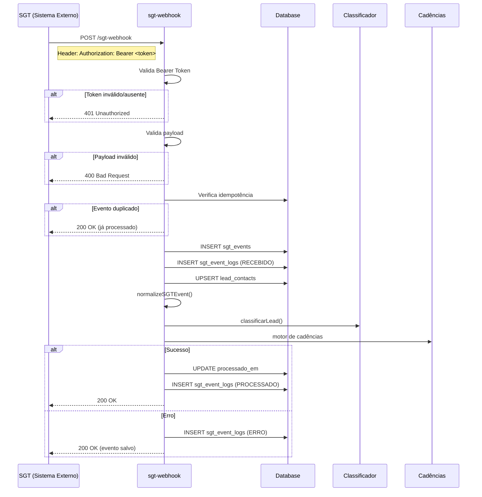

# 📦 PATCH 2 - Webhook SGT + Normalizador

**Data:** 2025-12-08  
**Épico:** O Sistema Passa a "Ouvir" o SGT  
**Status:** ✅ Implementado

---

## 🎯 Objetivo

Permitir que o SDR IA seja acionado automaticamente pelo SGT (Sistema de Gestão de Tráfego) através de webhooks. Quando o SGT gerar um evento, o sistema recebe, valida, normaliza e processa, iniciando o fluxo do SDR IA.

---

## 📁 Arquivos Criados/Modificados

| Arquivo | Tipo | Descrição |
|---------|------|-----------|
| `src/types/sgt.ts` | Novo | Tipos TypeScript para payload SGT |
| `supabase/functions/sgt-webhook/index.ts` | Novo | Edge function do webhook |
| `supabase/config.toml` | Modificado | Configuração da function (JWT disabled) |
| `docs/README.md` | Novo | Índice da documentação |
| `docs/CHANGELOG.md` | Novo | Log de mudanças |
| `docs/TEST-RESULTS.md` | Novo | Resultados de testes |
| `docs/patches/_TEMPLATE.md` | Novo | Template para patches |
| `docs/patches/PATCH-1_*.md` | Novo | Documentação retroativa Patch 1 |
| `docs/patches/PATCH-2_*.md` | Novo | Esta documentação |

---

## 🔐 Autenticação

A autenticação é feita via **Bearer Token** simples, enviado no header `Authorization`:

```http
Authorization: Bearer SEU_TOKEN_AQUI
```

O valor `SEU_TOKEN_AQUI` deve ser o mesmo configurado na secret:

```
SGT_WEBHOOK_SECRET=seu_token_secreto_aqui
```

### Respostas de Autenticação

| Cenário | Status | Resposta |
|---------|--------|----------|
| Token ausente | 401 | `{"error": "Unauthorized"}` |
| Token inválido | 401 | `{"error": "Unauthorized"}` |
| Token válido | 200 | Processamento normal |

---

## 📡 Endpoint

```http
POST /functions/v1/sgt-webhook
```

### Headers Obrigatórios

| Header | Valor | Descrição |
|--------|-------|-----------|
| `Content-Type` | `application/json` | Tipo do payload |
| `Authorization` | `Bearer <token>` | Token de autenticação |

---

## 🗄️ Alterações no Banco de Dados

### Enums Criados

```sql
-- Tipos de evento SGT
CREATE TYPE public.sgt_evento_tipo AS ENUM (
  'LEAD_NOVO',
  'ATUALIZACAO',
  'CARRINHO_ABANDONADO',
  'MQL',
  'SCORE_ATUALIZADO',
  'CLIQUE_OFERTA',
  'FUNIL_ATUALIZADO'
);

-- Empresas
CREATE TYPE public.empresa_tipo AS ENUM ('TOKENIZA', 'BLUE');

-- Status de processamento
CREATE TYPE public.sgt_event_status AS ENUM ('RECEBIDO', 'PROCESSADO', 'ERRO');
```

### Tabelas Criadas

```sql
-- Tabela principal de eventos SGT
CREATE TABLE public.sgt_events (
  id UUID PRIMARY KEY DEFAULT gen_random_uuid(),
  lead_id TEXT NOT NULL,
  empresa empresa_tipo NOT NULL,
  evento sgt_evento_tipo NOT NULL,
  payload JSONB NOT NULL,
  idempotency_key TEXT UNIQUE NOT NULL,
  recebido_em TIMESTAMPTZ DEFAULT now(),
  processado_em TIMESTAMPTZ,
  created_at TIMESTAMPTZ DEFAULT now()
);

-- Tabela de logs de auditoria
CREATE TABLE public.sgt_event_logs (
  id UUID PRIMARY KEY DEFAULT gen_random_uuid(),
  event_id UUID NOT NULL REFERENCES sgt_events(id) ON DELETE CASCADE,
  status sgt_event_status NOT NULL,
  mensagem TEXT,
  erro_stack TEXT,
  created_at TIMESTAMPTZ DEFAULT now()
);
```

### Índices

```sql
CREATE INDEX idx_sgt_events_lead_id ON public.sgt_events(lead_id);
CREATE INDEX idx_sgt_events_empresa ON public.sgt_events(empresa);
CREATE INDEX idx_sgt_events_evento ON public.sgt_events(evento);
CREATE INDEX idx_sgt_events_recebido_em ON public.sgt_events(recebido_em);
CREATE INDEX idx_sgt_events_idempotency ON public.sgt_events(idempotency_key);
CREATE INDEX idx_sgt_event_logs_event_id ON public.sgt_event_logs(event_id);
CREATE INDEX idx_sgt_event_logs_status ON public.sgt_event_logs(status);
```

### RLS Policies

| Tabela | Policy | Comando | Descrição |
|--------|--------|---------|-----------|
| sgt_events | Admins can view all events | SELECT | Admin vê todos eventos |
| sgt_events | Service can insert events | INSERT | Service role insere |
| sgt_events | Service can update events | UPDATE | Service role atualiza |
| sgt_event_logs | Admins can view all event logs | SELECT | Admin vê todos logs |
| sgt_event_logs | Service can insert event logs | INSERT | Service role insere |

---

## 📦 Payload SGT (Contrato de Dados)

```json
{
  "lead_id": "string",
  "evento": "LEAD_NOVO | ATUALIZACAO | CARRINHO_ABANDONADO | MQL | SCORE_ATUALIZADO | CLIQUE_OFERTA | FUNIL_ATUALIZADO",
  "empresa": "TOKENIZA | BLUE",
  "timestamp": "2025-01-01T12:00:00Z",

  "dados_lead": {
    "nome": "string",
    "email": "string",
    "telefone": "string",
    "utm_source": "string",
    "utm_medium": "string",
    "utm_campaign": "string",
    "utm_term": "string",
    "score": 45,
    "stage": "Contato Iniciado | Negociação | Perdido | Cliente"
  },

  "dados_tokeniza": {
    "valor_investido": 25000,
    "qtd_investimentos": 7,
    "qtd_projetos": 5,
    "ultimo_investimento_em": "2024-11-20"
  },

  "dados_blue": {
    "qtd_compras_ir": 2,
    "ticket_medio": 1800,
    "score_mautic": 38,
    "plano_atual": "IR_CRIPTO_GOLD"
  },

  "event_metadata": {
    "oferta_id": "XYZ123",
    "valor_simulado": 5000,
    "pagina_visitada": "/ofertas/xyz123"
  }
}
```

### Campos Obrigatórios Mínimos

- `lead_id`
- `evento`
- `empresa`
- `timestamp`
- `dados_lead.email` OU `dados_lead.telefone`

---

## ⚙️ Funcionalidades Implementadas

### PATCH 2.1 - Endpoint /sgt/webhook
1. ✅ Endpoint POST `/functions/v1/sgt-webhook`
2. ✅ Validação de Bearer Token
3. ✅ Validação de payload (campos obrigatórios)
4. ✅ Idempotência (evento não processado duas vezes)
5. ✅ Registro de evento bruto no banco

### PATCH 2.2 - Normalizador de Dados
6. ✅ Função `normalizeSGTEvent(payload)`
7. ✅ Tratamento de campos opcionais
8. ✅ Limpeza e formatação de dados (telefone, email)
9. ✅ Separação de dados por empresa

### PATCH 2.3 - Pipeline de Classificação
10. ✅ Integração com classificador comercial (Épico 3)
11. ✅ Motor de cadências chamado após classificação (Épico 4)

### PATCH 2.4 - Logs e Auditoria
12. ✅ Tabela `sgt_event_logs`
13. ✅ Status: RECEBIDO, PROCESSADO, ERRO
14. ✅ Captura de stack trace em erros

### PATCH 2.5 - Upsert de Contatos
15. ✅ Tabela `lead_contacts`
16. ✅ Upsert automático de dados de contato

---

## 🔄 Fluxo Interno (Resumo)

1. **Autenticação**: valida `Authorization: Bearer ...` com `SGT_WEBHOOK_SECRET`
2. **Validação**: checa campos obrigatórios do payload
3. **Idempotência**: evita processar o mesmo evento `lead_id + evento + timestamp` mais de uma vez
4. **Persistência**:
   - `sgt_events` recebe o evento bruto
   - `sgt_event_logs` registra status (RECEBIDO, PROCESSADO, ERRO)
   - `lead_contacts` recebe/atualiza dados de contato
5. **Classificação**: chama o classificador comercial (Épico 3)
6. **Cadência**: chama o motor de cadências (Épico 4) para iniciar/atualizar cadência adequada
7. **Retorno**: responde 200 OK ao SGT com JSON contendo status

---

## 📊 Diagrama de Fluxo



---

## 🔧 Configuração no SGT

Na tela de **"Novo Destino de Webhook"** do SGT, configure:

| Campo | Valor |
|-------|-------|
| **Nome** | SDR IA – Produção |
| **URL do Webhook** | `https://xdjvlcelauvibznnbrzb.supabase.co/functions/v1/sgt-webhook` |
| **Empresa** | Todas as empresas (ou conforme necessidade) |
| **Headers (JSON)** | Ver abaixo |

### Headers JSON

```json
{
  "Authorization": "Bearer SEU_TOKEN_AQUI",
  "Content-Type": "application/json"
}
```

> ⚠️ **Importante**: Mantenha `SEU_TOKEN_AQUI` sincronizado com a secret `SGT_WEBHOOK_SECRET`.

---

## 🧪 Testes

| # | Teste | Cenário | Resultado Esperado | Status |
|---|-------|---------|-------------------|--------|
| 1 | Token ausente | POST sem header Authorization | Rejeitar com 401 | ✅ Passou |
| 2 | Token inválido | Bearer diferente do SGT_WEBHOOK_SECRET | Rejeitar com 401 | ✅ Passou |
| 3 | SGT envia LEAD_NOVO | POST com payload válido | Endpoint aceita e registra evento | ✅ Passou |
| 4 | Payload inválido | POST sem lead_id | Rejeitar com 400 | ✅ Passou |
| 5 | Evento duplicado | Mesmo lead_id + evento + timestamp | Ignorar (idempotência) | ✅ Passou |
| 6 | Pipeline completo | Evento válido processado | Classificação + cadência executados | ✅ Passou |
| 7 | Dados TOKENIZA | Payload com dados_tokeniza | Normalizador extrai corretamente | ✅ Passou |
| 8 | Dados BLUE | Payload com dados_blue | Normalizador extrai corretamente | ✅ Passou |
| 9 | Payload parcial | Campos opcionais ausentes | Campos tratados com defaults | ✅ Passou |

---

## 📝 Como Testar

### Com Bearer Token (Produção)

```bash
curl -X POST https://xdjvlcelauvibznnbrzb.supabase.co/functions/v1/sgt-webhook \
  -H "Content-Type: application/json" \
  -H "Authorization: Bearer SEU_TOKEN_AQUI" \
  -d '{
    "lead_id": "lead_123",
    "evento": "LEAD_NOVO",
    "empresa": "TOKENIZA",
    "timestamp": "2025-01-01T12:00:00Z",
    "dados_lead": {
      "nome": "João Silva",
      "email": "joao@email.com",
      "telefone": "(11) 99999-9999",
      "score": 75,
      "stage": "Contato Iniciado"
    },
    "dados_tokeniza": {
      "valor_investido": 50000,
      "qtd_investimentos": 3,
      "qtd_projetos": 2
    }
  }'
```

### Resposta Esperada (Sucesso)

```json
{
  "success": true,
  "event_id": "uuid-do-evento",
  "lead_id": "lead_123",
  "evento": "LEAD_NOVO",
  "empresa": "TOKENIZA",
  "classification": {
    "icp": "TOKENIZA_SERIAL",
    "persona": "CONSTRUTOR_PATRIMONIO",
    "temperatura": "QUENTE",
    "prioridade": 90
  },
  "cadence": {
    "started": true,
    "cadence_code": "TKZ_WHATSAPP_QUENTE"
  }
}
```

### Resposta Esperada (Token Inválido)

```json
{
  "error": "Unauthorized"
}
```

---

## ✅ Checklist de Aderência

- [x] Função exige header Authorization com Bearer válido
- [x] Payload é validado (campos mínimos)
- [x] Idempotência implementada
- [x] Eventos são salvos em `sgt_events`
- [x] Logs são salvos em `sgt_event_logs`
- [x] `lead_contacts` é atualizado
- [x] Classificador é chamado
- [x] Motor de cadências é chamado quando aplicável
- [x] Respostas de erro são informativas (401, 400, etc.)

---

## 🔧 Configurações Necessárias

- [x] Secret `SGT_WEBHOOK_SECRET` configurado
- [x] Edge function com `verify_jwt = false`
- [ ] SGT configurado para enviar webhooks

---

## 🔗 Dependências

- **PATCH 1** - Autenticação + RBAC (para visualização de eventos no dashboard)
- **PATCH 3** - Classificador Comercial (chamado automaticamente)
- **PATCH 4** - Motor de Cadências (chamado automaticamente)
