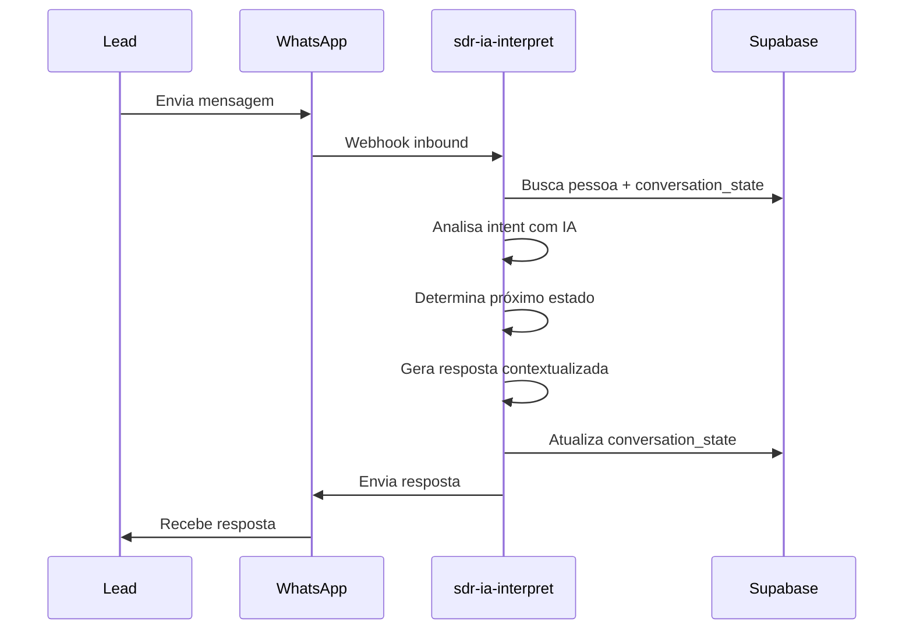

# PATCH-6: SDR Conversacional Inteligente

## Status: ✅ IMPLEMENTADO

**Data de conclusão:** 2025-12-11

---

## Objetivo

Implementar um SDR IA capaz de conduzir conversas multi-turno inteligentes, adaptando tom e estratégia conforme o perfil DISC do lead, estado no funil de vendas e contexto multi-empresa (Tokeniza + Blue).

---

## Escopo

### Funcionalidades Implementadas

1. **Entidade Pessoa Global**
   - Tabela `pessoas` para unificar contatos entre empresas
   - Vinculação via `pessoa_id` em `lead_contacts`
   - Perfil DISC e idioma preferido por pessoa

2. **Estado de Conversa**
   - Tabela `lead_conversation_state` para rastrear progresso
   - Estados do funil: SAUDACAO → DIAGNOSTICO → QUALIFICACAO → OBJECOES → FECHAMENTO → POS_VENDA
   - Frameworks de qualificação: GPCT (Tokeniza), SPIN (Blue), BANT

3. **SDR IA Conversacional**
   - Respostas automáticas contextualizadas
   - Adaptação de tom baseada em perfil DISC
   - Coleta progressiva de dados de qualificação
   - Transições inteligentes entre estados do funil

4. **UI de Visualização**
   - `PessoaCard`: exibe dados globais da pessoa e relacionamentos
   - `ConversationStateCard`: mostra estado do funil e progresso do framework

---

## Estrutura de Dados

### Tabela: `pessoas`
```sql
CREATE TABLE public.pessoas (
  id UUID PRIMARY KEY DEFAULT gen_random_uuid(),
  nome TEXT NOT NULL,
  telefone_e164 TEXT,
  telefone_base TEXT,  -- Últimos 8 dígitos
  ddd TEXT,
  email_principal TEXT,
  idioma_preferido TEXT DEFAULT 'PT',
  perfil_disc TEXT,    -- D, I, S, C
  created_at TIMESTAMPTZ DEFAULT now(),
  updated_at TIMESTAMPTZ DEFAULT now()
);
```

### Tabela: `lead_conversation_state`
```sql
CREATE TABLE public.lead_conversation_state (
  id UUID PRIMARY KEY DEFAULT gen_random_uuid(),
  lead_id TEXT NOT NULL,
  empresa empresa_tipo NOT NULL,
  canal canal_tipo DEFAULT 'WHATSAPP',
  estado_funil estado_funil_tipo DEFAULT 'SAUDACAO',
  framework_ativo framework_tipo DEFAULT 'NONE',
  framework_data JSONB DEFAULT '{}',
  perfil_disc TEXT,
  idioma_preferido TEXT DEFAULT 'PT',
  ultima_pergunta_id TEXT,
  ultimo_contato_em TIMESTAMPTZ DEFAULT now(),
  created_at TIMESTAMPTZ DEFAULT now(),
  updated_at TIMESTAMPTZ DEFAULT now()
);
```

### Enums
```sql
-- Estado do funil
CREATE TYPE estado_funil_tipo AS ENUM (
  'SAUDACAO', 'DIAGNOSTICO', 'QUALIFICACAO', 
  'OBJECOES', 'FECHAMENTO', 'POS_VENDA'
);

-- Frameworks de vendas
CREATE TYPE framework_tipo AS ENUM ('GPCT', 'BANT', 'SPIN', 'NONE');

-- Tipo de relação pessoa-empresa
CREATE TYPE pessoa_relacao_tipo AS ENUM (
  'CLIENTE_IR', 'LEAD_IR', 'INVESTIDOR', 
  'LEAD_INVESTIDOR', 'DESCONHECIDO'
);
```

---

## Tipos TypeScript

### `src/types/pessoa.ts`
- `Pessoa`: entidade global da pessoa
- `EmpresaRelacionamentoResumo`: resumo por empresa
- `PessoaRelacaoTipo`: tipo de relacionamento
- `PerfilDISC`: D, I, S, C
- Helpers: `formatPhoneDisplay`, `determineRelacaoTipo`

### `src/types/conversation.ts`
- `ConversationState`: estado completo da conversa
- `EstadoFunil`: estados do pipeline
- `FrameworkAtivo`: framework em uso
- `GPCTState`, `BANTState`, `SPINState`: dados dos frameworks
- Helpers: `getDefaultFramework`, `getFrameworkCompleteness`

---

## Hooks

### `usePessoaContext`
```typescript
const { data, isLoading } = usePessoaContext({
  leadId: 'lead_123',
  empresa: 'TOKENIZA'
});
// Retorna: { pessoa, relacionamentos }
```

### `useConversationState`
```typescript
const { data: state, isLoading } = useConversationState({
  leadId: 'lead_123',
  empresa: 'TOKENIZA'
});
// Retorna: ConversationState | null
```

---

## Componentes

### `PessoaCard`
Exibe informações globais da pessoa:
- Nome, telefone, email
- Badge de perfil DISC com dica de comunicação
- Lista de relacionamentos por empresa (CLIENTE_IR, INVESTIDOR, etc.)
- Idioma preferido

### `ConversationStateCard`
Exibe estado da conversa:
- Badge do estado atual no funil
- Canal (WhatsApp/Email)
- Barra de progresso do framework
- Campos preenchidos do framework (GPCT/SPIN/BANT)
- Último contato

---

## Fluxo de Funcionamento



---

## Regras de Negócio

### Transições de Estado do Funil

| Estado Atual | Intent Detectado | Próximo Estado |
|--------------|-----------------|----------------|
| SAUDACAO | INTERESSE_COMPRA | DIAGNOSTICO |
| SAUDACAO | CUMPRIMENTO | SAUDACAO |
| DIAGNOSTICO | DUVIDA_PRODUTO | QUALIFICACAO |
| QUALIFICACAO | OBJECAO_* | OBJECOES |
| OBJECOES | INTERESSE_COMPRA | FECHAMENTO |
| FECHAMENTO | * | POS_VENDA |

### Adaptação por Perfil DISC

| Perfil | Tom Recomendado |
|--------|-----------------|
| D (Dominante) | Direto, objetivo, foco em resultados |
| I (Influente) | Amigável, entusiasta, social |
| S (Estável) | Paciente, acolhedor, seguro |
| C (Cauteloso) | Dados, estrutura, detalhes |

### Detecção Automática de DISC (PATCH-6B)

A IA detecta automaticamente o perfil DISC baseado em indicadores nas mensagens:

| Perfil | Indicadores |
|--------|-------------|
| **D** | Mensagens curtas, imperativos ("Quero", "Quanto?"), foco em resultados |
| **I** | Emojis, exclamações, histórias pessoais, entusiasmo |
| **S** | Tom calmo, "por favor/obrigado", preocupação com segurança |
| **C** | Perguntas técnicas, pede documentos/dados, analítico |

**Regras:**
- Não detecta se não houver indicadores claros (ex: só "oi")
- Analisa histórico completo, não apenas mensagem atual
- Salva em `lead_conversation_state.perfil_disc` E `pessoas.perfil_disc`
- Não sobrescreve perfil já definido manualmente

### Frameworks por Empresa

- **Tokeniza**: GPCT (Goals, Plans, Challenges, Timeline)
- **Blue**: SPIN (Situation, Problem, Implication, Need-payoff)

---

## Arquivos Criados/Modificados

### Novos
- `src/types/pessoa.ts`
- `src/types/conversation.ts`
- `src/hooks/usePessoaContext.ts`
- `src/hooks/useConversationState.ts`
- `src/components/pessoa/PessoaCard.tsx`
- `src/components/conversation/ConversationStateCard.tsx`

### Modificados
- `src/pages/LeadDetail.tsx` - integração dos novos cards
- `supabase/functions/sdr-ia-interpret/index.ts` - lógica conversacional + detecção DISC

### Migrations
- `20250611_create_pessoas_table.sql`
- `20250611_create_conversation_state.sql`
- `20250611_add_pessoa_id_to_contacts.sql`

---

## Testes Realizados

1. ✅ Criação de pessoa global ao receber mensagem
2. ✅ Vinculação de lead_contact a pessoa
3. ✅ Criação de conversation_state inicial
4. ✅ Transição de estados do funil
5. ✅ Resposta automática contextualizada
6. ✅ UI exibindo dados da pessoa e estado da conversa
7. ✅ Detecção automática de perfil DISC via IA

---

## Próximos Passos (Futuro)

1. ~~**PATCH-6B**: Detecção automática de perfil DISC via IA~~ ✅ IMPLEMENTADO
2. **PATCH-6C**: Histórico de conversas entre empresas
3. **PATCH-6D**: Dashboard de performance do SDR IA por estado
4. **PATCH-6E**: A/B testing de mensagens por perfil DISC
