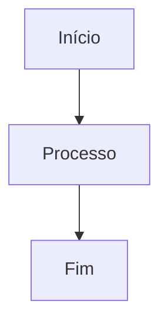

# 📦 PATCH [N] - [TÍTULO DO PATCH]

**Data:** YYYY-MM-DD  
**Épico:** [Nome do Épico]  
**Status:** ⏳ Em Desenvolvimento | ✅ Implementado | ❌ Cancelado

---

## 🎯 Objetivo

[Descreva o objetivo principal do patch em 2-3 frases]

---

## 📁 Arquivos Modificados

| Arquivo | Tipo | Descrição |
|---------|------|-----------|
| `path/to/file.ts` | Novo/Modificado | Descrição breve |

---

## 🗄️ Alterações no Banco de Dados

### Tabelas Criadas

```sql
-- Cole aqui o SQL das tabelas criadas
```

### Enums Criados

```sql
-- Cole aqui o SQL dos enums criados
```

### RLS Policies

| Tabela | Policy | Comando | Descrição |
|--------|--------|---------|-----------|
| `tabela` | Nome da policy | SELECT/INSERT/UPDATE/DELETE | Descrição |

---

## ⚙️ Funcionalidades Implementadas

1. ✅ Funcionalidade 1
2. ✅ Funcionalidade 2
3. ⏳ Funcionalidade 3 (pendente)

---

## 🧪 Testes

| # | Teste | Cenário | Resultado Esperado | Status |
|---|-------|---------|-------------------|--------|
| 1 | Nome do teste | Descrição do cenário | O que deve acontecer | ✅/⏳/❌ |

---

## 🔧 Configurações Necessárias

- [ ] Configuração 1
- [ ] Configuração 2

---

## 📊 Diagrama de Fluxo



---

## 📝 Notas Adicionais

[Qualquer informação adicional relevante]

---

## 🔗 Dependências

- PATCH [N-1] - [Nome do patch anterior]
